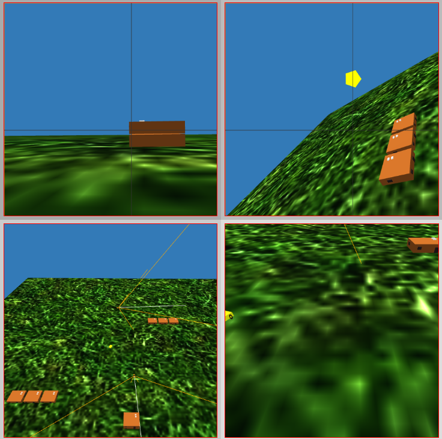
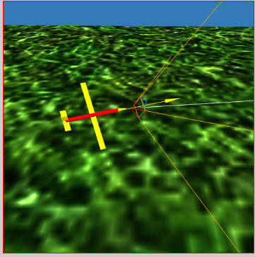
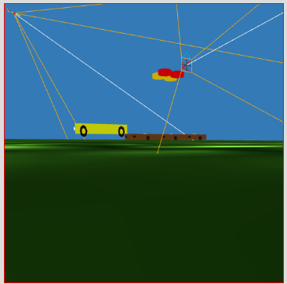

### Mavlink 3D-Map

This tool receives navigation information via MAVLINK, and display vehicles in 3D environment using [three.js ](https://threejs.org/ "three.js ").

The tool can display multiple view ports, each one has a world camera besides all cameras attached to vehicles. so you can monitor from multiple views at the same time.

### Feature

- Reads vehicle location and orientation via mavlink.
- Display vehicles in 3D Map.
- Add cameras to vehicles and allows fpv:
P & O buttons used to switch between cameras. If there is SITL connected to the map then it will have its own camera and you can switch to it using P & W. then you can control it using W, S , A , D. You can press R to reset camera orientation.

    

### App Structure

The application has two parts:
- **Website** that runs and uses websockets.
- **UDP2WebSocket** this is a nodejs app that receives udp packets from **SITL** and send equivelant data via websocket to Website.

### Mavlink 3D-Map

This tool receives navigation information via MAVLINK, and display vehicles in 3D environment using [three.js ](https://threejs.org/ "three.js ").

The tool can display multiple view ports, each one has a world camera besides all cameras attached to vehicles. so you can monitor from multiple views at the same time.

### Feature

- Reads vehicle location and orientation via mavlink.
- Display vehicles in 3D Map.
- Add cameras to vehicles and allows fpv.

### App Structure

The application has three parts:
- **Website** that runs and uses websockets.
- **UDP2WebSocket** this is a nodejs app that receives udp packets from **SITL** and send equivelant data via websocket to Website.

###Example
Running two vehicles "Quad & Plane"

####Plane
> python3  ~/TDisk/out_gits/ardupilot/Tools/autotest/sim_vehicle.py  -j4 -v ArduPlane  -M --map --console --instance 80 --out=udpout:127.0.0.1:14550 --out=udpout:127.0.0.1:16450

####Quad

> python3  ~/TDisk/out_gits/ardupilot/Tools/autotest/sim_vehicle.py -j4 -v ArduCopter    -M --map --console --instance 70 --out=udpout:127.0.0.1:16450  --out=udpout:127.0.0.1:14450  --add-param-file=./quadPlus_2.parm

quadPlaus_2.param is a parameter file that specifies ID of the vehicle so that the system knows it is another vehicle.

**QuadPlus_2.param**
> SYSID_THISMAV    2
FRAME_CLASS      1.000000
FRAME_TYPE       0.000000

**instance** specified to run SITL on different ports.

Drone:

Now run websocket:
> node udp2websocket.js

Run Website
> cd static
http-server -c0

http://127.0.0.1:9080/index_4w.html
or 
http://127.0.0.1:9080/index_4wRealMap.html 

for VTOL you can add 
http://127.0.0.1:9080/index_4w.html?vtol

http://127.0.0.1:9080/index_4w.html?vtol

That is all ... you should be able to see vehicles.

You can define your own extra environment robots and objects.

You can also fly in different places by adding location for example:
http://127.0.0.1:9080/index_4w3dReal.html?lng=31.1339&lat=29.9764

Have fun !
